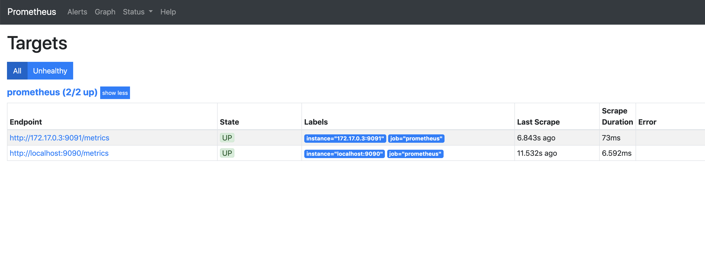

# couchbase_exporter

## Summary

The Couchbase Prometheus Exporter is an official [Prometheus Exporter](https://prometheus.io/docs/instrumenting/exporters/) which supplies Couchbase Server metrics to Prometheus.
These include, but are not limited to, CPU and Memory usage, Ops per second, read and write rates, and queue sizes. 
Metrics can be refined to a per node and also a per bucket basis. 

### Technical Overview

We run four main collectors (as is the standard for prometheus exporters. see [Writing Exporters](https://prometheus.io/docs/instrumenting/writing_exporters/)) for bucketInfo, bucketStats, nodes, and tasks. These are items that collect cluster-wide statistics on demand when requested by something like say for example, Grafana. 

What we do not run a collector for is for the specific “per-server” statistics that exist for each Couchbase node. For this we run a pernode_bucketstats program which, by default, every 5 seconds, reports to Prometheus statistics for the current node it is running on only, and does not concern itself with other nodes’ statistics. 

Most of the useful statistics will be found in bucketStats, nodes and perNodeBucketStats. 

## Usage

### Couchbase Exporter Arguments
| Arg | Description | Default |
| ------- | ------- | ------------|
| `--couchbase-address` | The address where Couchbase Server is running | localhost  |
| `--couchbase-port` | The port where Couchbase Server is running | 8091  |
| `--couchbase-username` | Couchbase Server Username | Administrator |
| `--couchbase-password` | Couchbase Server Password | password |
| `--server-address` | The address to host the server on | 127.0.0.1 | 
| `--server-port` | The port to host the server on | 9091 |
| `--per-node-refresh` | How frequently to collect `per_node_bucket_stats` in seconds | 5 |

### Docker

#### Local Setup

If you have Couchbase server running locally, run the command `docker build --tag couchbase-exporter:v1 .` to build the image.

Then run `docker run --name couchbase-exporter -d -p 9091:9091 couchbase-exporter:v1`.
This will run the exporter with the default arguments above.

To specify the arguments, edit the CMD line in the Dockerfile provided. Note that specifying arguments is completely optional.
For example, if you are running Couchbase at the address 10.1.2.3 with a port 9000, and a new password, 
and your Prometheus server is running at 10.0.0.1 on its default port, the file would be:

```
FROM alpine:3.6
ADD couchbase_exporter /usr/local/bin
ADD main.go /usr/local/bin
CMD ["couchbase_exporter", "--couchbase-address", "10.1.2.3", "--couchbase-port", "9000", "--couchbase-password", "mrkrabs101", "--server-address", 10.0.0.1]
```
#### Docker Setup

If running Couchbase as a separate Docker container, use `docker network list` to 
get the ID of the `bridge` network where Couchbase Server should be running.

Then use `docker network inspect <network-ID>` to get the address of Couchbase Server.

```
"Containers": {
            "d2e4d563998893ce457bd672f40a60b849533541ccc883052943e44469331f71": {
                "Name": "db",
                "EndpointID": "<endpointID>",
                "MacAddress": "<mac>",
                "IPv4Address": "172.17.0.2/16",
                "IPv6Address": ""
            }
        },
```

In this example, we would include `"--couchbase-address", "172.17.0.2"` in the CMD array when building.

In both cases, you should see the exporter displaying metrics at `localhost:9091/metrics`.

### Standalone
Navigate to either `bin/darwin` to build for Mac or `bin/linux` in your terminal.
Run `couchbase_exporter` with the any of the optional arguments.

## Setting up Monitoring tools

To consume the metrics, we need to set up Prometheus and optionally Grafana to create custom dashboards.

There are a couple of ways to install and configure both. 
The easiest way by far is to run the [kube-prometheus](https://github.com/coreos/kube-prometheus) package, which bundles 
the Prometheus Operator, AlertManager, Grafana, and many others. This is great if you are running Couchbase Automonous Operator.
Alternatively, you can check out the official [Prometheus Helm Chart](https://github.com/helm/charts/tree/master/stable/prometheus).  

Otherwise see below.

### Prometheus

#### Local Setup

If you wish to download and run Prometheus locally, follow this [link](https://prometheus.io/download/) and 
use our provided `prometheus.yml` which contains the scrape_config that includes a look-up for `localhost:9091` - 
which is where the exporter metrics should be served.

Run prometheus and `http://localhost:9091/metrics` should appear on the list of Prometheus targets at `localhost:9090/targets` 
and report as ACTIVE.

#### Docker Setup

If you have Couchbase Exporter running as a Docker container, the provided `prometheus.yml` configuration will need editing
as the `localhost:9091` will be reported as DOWN. As with the [previous Docker Setup section](#docker-setup), use the commands
`docker network list` and `docker network inspect <network-ID>` to find the IPv4 Address of the Couchbase Exporter container and 
substitute this value for `localhost` in the list of scrape targets. The port will still, obviously, be `9091`.

For example:
```
 static_configs:
      - targets: ['localhost:9090', '172.17.0.3:9091']
```
Now run 

`docker build -f promDocker -t my-prometheus .` 

to build the image and

`docker run --name prometheus -d -p 9090:9090 my-prometheus` 

to run the Prometheus Server with our custom config.
The Targets page should now look something like the following.



#### AlertManager

Alerts can be set up in the provided `alerts_rules.yml` or specify a different YAML file name under the 
`rule_files` heading in `prometheus.yml`. The template for an alerting rule is as follows:

```
- alert: alertname
  expr: prometheus-expression
  annotations:
    summary: of the alert
    description: of the alert
  for: how long expr must be true for (optional)
  labels:
    optional labels
```

More information can be found over at the [official documentation](https://prometheus.io/docs/alerting/overview/), 
which also provides good examples. 

#### Queries

Again, the [official documentation](https://prometheus.io/docs/prometheus/latest/querying/basics/) provides more info and
examples.

The most common query you will use through Prometheus' PromQL involves the Instant vector selector, which is where 
we shall specify any label values. For example:

```
couchbase_bucketstat_couch_docs_disk_size{bucket="beer-sample"}
couchbase_bucketstat_cpu_utilization_rate{pod="cb-example-0000", bucket="default"}
couchbase_per_node_bucket_curr_connections{node="172.17.0.2:8091", bucket="gamesim-sample", namespace="monitoring"}
```

Prometheus includes a simple graphing tool to display multiple queries at once, but for full
customisability and control, it is recommended to export Prometheus metrics into Grafana and use that. 

### Grafana

The easiest way to setup [Grafana](https://github.com/grafana/grafana) is to run it as a docker container:
`docker run -d -p 3000:3000 grafana/grafana`
This hosts the dashboard on `localhost:3000`. To login the username and password are both "admin".


Example Grafana Dashboards have been included within the repository. To import the dashboard of your choice, 
hover over to the plus icon on the left sidebar and select "Import". Then copy and paste the JSON from 
one of the two files provided.


## Reporting Bugs and Issues
Please use our official [JIRA board](https://issues.couchbase.com/projects/PE/issues/?filter=allopenissues) to report any bugs and issues. 

## License

Copyright 2019 Couchbase Inc.

Licensed under the Apache License, Version 2.0

See [LICENSE](https://github.com/couchbase/couchbase_exporter/blob/master/LICENSE) for further details.
